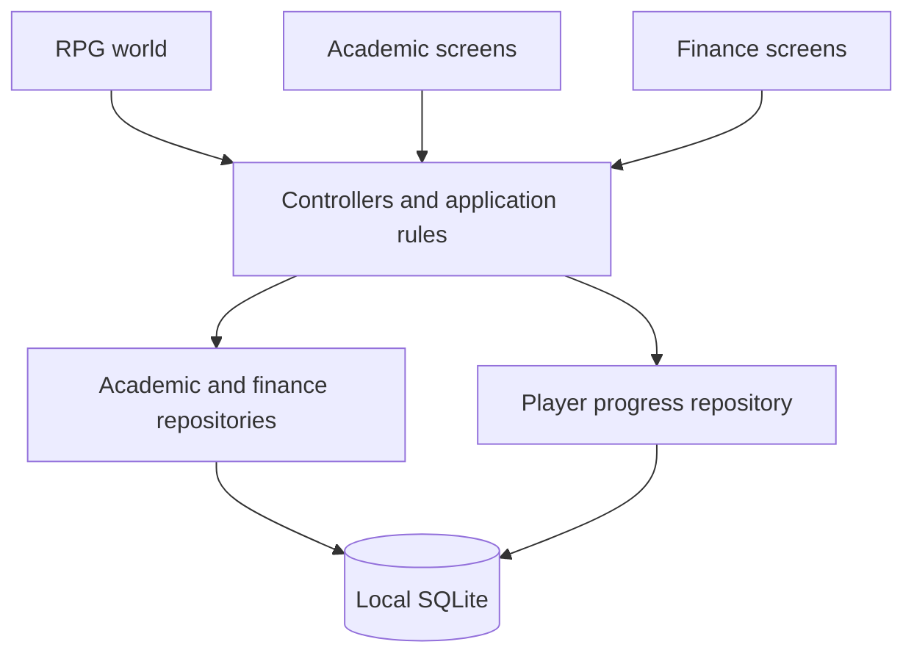

# 🎓 Student Life RPG

### Make everyday progress part of your adventure.

**学业规划 · 个人财务 · 角色成长**

A gamified university-life application that brings academic planning,
personal finance and RPG progression into one interactive experience.

[Documentation](docs/README.md) · [Product](docs/product/overview.md) · [Architecture](docs/architecture/architecture.md) · [Contributing](CONTRIBUTING.md)

---

## The idea

University life is spread across timetables, deadlines, grades and spending records. **Student Life RPG** brings these responsibilities into a proposed mobile experience, with a pixel-art RPG world connecting everyday actions to character growth.

**Plan your day. Complete meaningful tasks. Watch your character grow.**

> **Current baseline:** product requirements, architecture specifications, collaboration rules and test designs. Application source code and verified execution evidence are awaiting import. Actual code paths, running commands and test results are deliberately left blank.

## One world, four connected modules

| Module | Student experience | Planned Alpha scope |
| :--- | :--- | :--- |
| **RPG World** | Explore a personal space and access useful tools | Movement, collision, prompts, scene navigation and fixed HUD |
| **Academic** | Keep academic obligations together | Semesters, courses, assignments, exams, calendar and GPA |
| **Finance** | Understand everyday spending | Income, expenses, budgets and summaries |
| **Gamification** | Make completed tasks visible | EXP, coins, levels and player progress |

The proposed visual direction is **portrait, 2.5D pixel art**. Real screenshots and demo evidence will be added after source import. AI, social features, multiplayer and complex farming remain outside Alpha scope.

## The Alpha acceptance journey

Create an academic task, see it in the calendar, complete it, apply its reward once, refresh the HUD and restart without losing data.

The acceptance gates require correct persisted values, no duplicate rewards and actionable failure feedback. Finance and GPA also have independent calculation checks.

[Explore user stories →](docs/product/user-stories.md)

## Architecture at a glance

| Design choice | Reason | Consequence |
| :--- | :--- | :--- |
| Local Alpha | Demonstrate a complete journey without mandatory cloud services | No cross-device synchronization yet |
| Repository contracts | Separate UI from storage and make behavior testable | Shared contracts require coordinated review |
| Atomic reward grant | Prevent duplicate rewards and partial progress updates | Completion and grant policy must be explicit |
| Feature ownership | Keep most team changes within a module | Cross-feature workflows need an integration owner |

FastAPI, PostgreSQL, authentication and synchronization remain future options. Exact SDK, scene engine and state-management packages will be established after code audit.

[Architecture](docs/architecture/architecture.md) · [Data flow](docs/architecture/data-flow.md) · [Database](docs/architecture/database-design.md) · [Decisions](docs/architecture/decisions.md)

## Engineering documentation

| Question | Document |
| :--- | :--- |
| What are we building? | [Product overview](docs/product/overview.md) |
| What must it do? | [Requirements](docs/product/requirements.md) and [user stories](docs/product/user-stories.md) |
| Why this design? | [Architecture decision records](docs/architecture/decisions.md) |
| How do we collaborate? | [Contribution guide](CONTRIBUTING.md), [Git workflow](docs/development/git-workflow.md) and [responsibilities](docs/project-management/team.md) |
| How do we verify it? | [Test strategy](docs/testing/strategy.md) and [21 designed test cases](docs/testing/test-cases.md) |
| How do we deliver it? | [Roadmap](docs/project-management/roadmap.md) and [risk register](docs/project-management/risks.md) |

[Browse the complete documentation hub →](docs/README.md)

## Delivery roadmap

| Phase | Outcome | Exit gate |
| :--- | :--- | :--- |
| **Foundation** | Specifications and collaboration templates | Team review and open decisions assigned |
| **Runnable baseline** | Existing app imported and reproducible | Clean checkout starts on selected target |
| **Connected Alpha** | Academic, finance and RPG progression connected | P0 journeys persist correct data |
| **Verified demo** | Executed checks, applicable CI and demo | Evidence names revision and environment |
| **Cloud evaluation** | Assess accounts and synchronization | Approved separate scope and decision |

## Development and quality

The working agreement is **Issue → Branch → PR → Review → Merge**. Link requirement and test IDs, keep one main issue active per contributor and review shared-contract changes with affected owners.

Feature, bug and engineering-task forms live in `.github/ISSUE_TEMPLATE/`; the PR template requests behavior, validation and review evidence. Branch protection and CI enforcement must be configured separately after source import.

<strong>Implementation records awaiting verification</strong>

- [Actual code structure](docs/development/project-structure.md): blank.
- [Environment versions and running commands](docs/development/setup.md): blank.
- [Test execution results](docs/testing/test-cases.md#execution-results): blank.

<strong>Planned quality evidence</strong>

Unit checks for GPA, budgets and rewards; repository checks for persistence, migrations and atomic updates; widget and integration checks for user journeys; manual checks for scene movement and interaction. Planned checks are not passing results.

---

**Student Life RPG** · A university software engineering project

Build useful daily habits. Give progress a place in your world.

