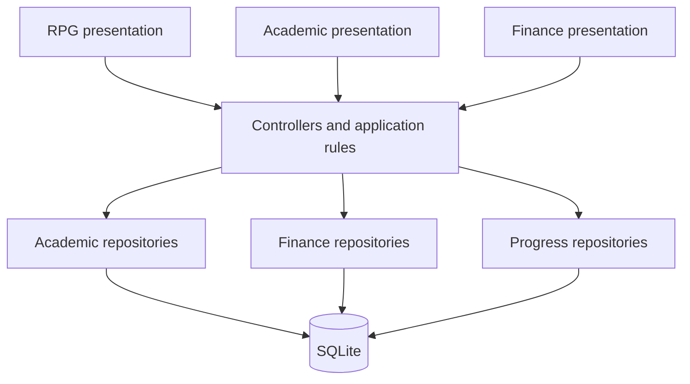

# System Architecture

> Proposed local Alpha design. Exact framework packages and source paths are pending code import.

## Structure and dependency direction

| Layer | Owns | Must not do |
| --- | --- | --- |
| Presentation | Rendering, forms, navigation and input | Execute SQL or calculate authoritative rewards |
| Application/controllers | User actions, validation, workflow state and cross-feature coordination | Depend on a particular visual scene |
| Domain | Entities and pure GPA, budget and reward rules | Import widgets or database drivers |
| Repository interfaces | Contracts for feature data and atomic workflows | Expose SQL rows or database handles to UI |
| Data/storage | Mapping, queries, transactions and migrations | Decide how widgets are rendered |

Dependencies point toward contracts and business rules. Composition at app startup supplies concrete repositories. Feature-first organization is the intended code structure; actual directories remain blank in the [structure record](../development/project-structure.md).

## Feature boundaries

| Feature | Data ownership | Cross-feature contract |
| --- | --- | --- |
| Academic | Semester, Course, Assignment, Exam, Event, Task | A task identity and a completion workflow |
| Finance | Transaction and Budget | No Alpha dependency on rewards |
| Gamification | PlayerProgress and RewardGrant | Award one eligible task completion |
| RPG World | Scene, position, collision and interaction state | Open a module; read progress; never award rewards directly |

Assignment and exam records may reference tasks. The implementation must choose one authoritative completion status and avoid independent flags that drift apart. Achievements are deferred until the core progression is stable.

## Atomic task completion

One application workflow coordinates task completion, an idempotent reward grant and progress persistence in a single database transaction. A unique constraint on reward source prevents duplicate grants. Publish the state update only after commit. Domain rules remain pure; repositories implement the atomic persistence contract.

## RPG movement and interaction

Keep logical position and collision bounds separate from drawing coordinates. Resolve movement against room and furniture bounds, then project into the scene. A blocked axis must not prevent valid movement on the other axis. Scene interaction uses logical distance/range and triggers navigation once per activation. Fixed HUD widgets belong to screen space.

The final scene engine, coordinate projection and state-management library are open decisions to resolve after code audit. Existing code should be adapted incrementally rather than replaced solely to match a directory diagram.

## Future cloud boundary

Repository contracts help isolate transport changes, but replacing SQLite with API calls does not solve synchronization. Cloud work requires user identity, conflict policy, retries, ownership checks and an offline strategy. FastAPI and PostgreSQL remain future options rather than Alpha dependencies.

[Data flow](data-flow.md) · [Database design](database-design.md) · [Decisions](decisions.md) · [Architecture index](README.md)
