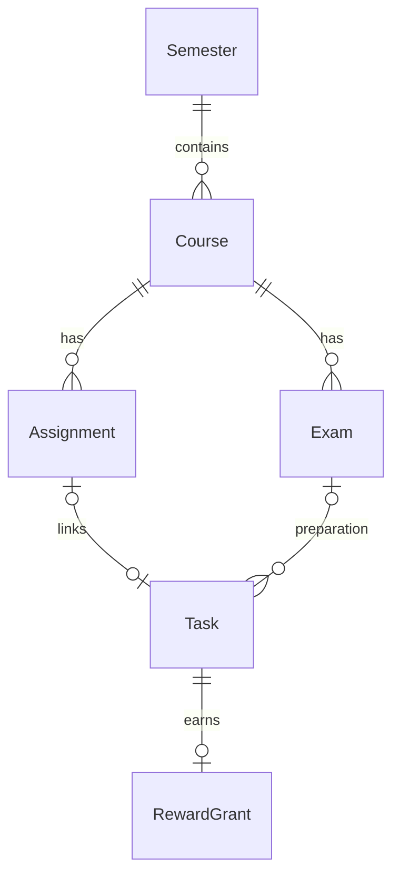

# Logical Database Design

> Design proposal. No migration or physical schema is claimed to exist yet.

## Entity relationships

Standalone tasks are permitted. Course association on a task is optional. Exact foreign keys and deletion behavior must be established in migrations and tests.

| Entity | Proposed fields | Key constraint |
| --- | --- | --- |
| Semester | id, name, startDate, endDate | Start date does not follow end date |
| Course | id, semesterId, title, credits, grade, schedule | Existing semester; positive credits |
| Assignment | id, courseId, title, dueAt, taskId | Existing course; at most one linked completion task |
| Exam | id, courseId, title, startsAt, location | Existing course |
| Event | id, title, startsAt, endsAt | Valid time range |
| Task | id, title, dueAt, status, courseId, completedAt | Valid status; completedAt matches completion policy |
| Transaction | id, type, amountMinor, currency, category, occurredOn, note | Positive integer amount; supported currency |
| Budget | id, category, month, currency, limitMinor | Unique category/month/currency; nonnegative limit |
| PlayerProgress | id, totalExp, coins | One local player; nonnegative values |
| RewardGrant | id, taskId, rewardType, exp, coins, ruleVersion, grantedAt | Unique taskId/rewardType; nonnegative grant |

## Storage conventions

- Use stable IDs independent of displayed names.
- Enable and test foreign-key enforcement on each database connection.
- Store money in integer minor units, with currency recorded explicitly.
- Use a documented convention for date-only values and UTC instants; convert instants for display.
- Persist total EXP and derive level from a versioned threshold table; avoid independently editable totals and levels.
- Use parameterized queries and explicit mappings; do not expose raw database rows to UI.

Course schedules may require a separate meeting table; determine this when recurrence rules are agreed. This document intentionally avoids pretending that the conceptual entities are final SQL tables.

## Deletion and audit policy

Confirm referenced course deletion behavior before coding; reject or explicitly cascade according to approved requirements. Retain enough reward history to prevent a corrected or reopened task from earning again. Do not remove grant history merely to make task deletion simpler.

## Migration requirements

Track a schema version. Each supported upgrade must preserve prior data, run in a transaction when supported, and have a fixture-based migration test. Record downgrade support explicitly rather than assuming it.

## Physical schema and migrations

<!-- Intentionally blank: fill from the actual implementation after code import. -->

[Architecture index](README.md)
